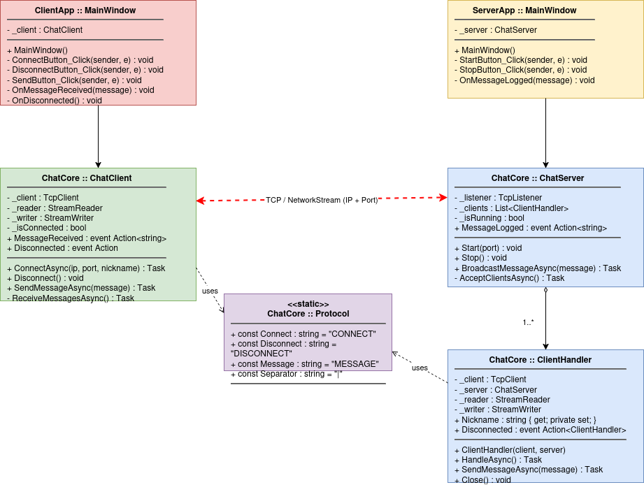

# ChatApp

Клиент-серверное приложение для обмена сообщениями в реальном времени, разработанное на платформе .NET 8.0 с использованием языка C# 12.0 и кроссплатформенного UI-фреймворка Avalonia. В основе сетевого взаимодействия лежит прямое использование TCP-сокетов и собственного строкового протокола.

## Структура решения

Решение разделено на три основных модуля:

* **ChatCore**: Общая библиотека классов. Инкапсулирует в себе всю логику работы с сетью (`ChatClient`, `ChatServer`), управление подключенными узлами (`ClientHandler`) и парсинг текстового протокола (`Protocol`).
* **ServerApp**: Графическое приложение сервера. Позволяет управлять запуском слушателя (TCP Listener) на заданном порту, вести мониторинг активных подключений и просматривать терминальный лог в реальном времени.
* **ClientApp**: Графическое приложение клиента. Предоставляет пользователю интерфейс для подключения к серверу (указание IP, Порта и Никнейма), отправки сообщений в общую комнату, просмотра списка пользователей в сети и обмена личными сообщениями.

## Ключевые возможности

### Сервер
* Запуск и остановка TCP-сервера с возможностью указания порта (по умолчанию `5000`).
* Многопоточная обработка входящих соединений (отдельный `Thread` выделяется для каждого подключенного клиента).
* Отслеживание общего числа активных пользователей через встроенный счетчик.
* Предотвращение подключения пользователей с уже занятыми никнеймами.
* Ведение логов подключений, отключений и системных ошибок.

### Клиент
* Асинхронное получение сообщений через фоновый поток чтения, не блокирующий UI.
* Глобальный чат для всех подключенных участников.
* Отображение актуального списка пользователей, находящихся в сети.
* Поддержка приватных (личных) сообщений конкретному пользователю.

## Протокол связи

Сетевой обмен реализован через потоки чтения и записи строк (`StreamReader` / `StreamWriter`) с использованием кодировки UTF-8. 

* **Команды от клиента:** * `/join <ник>` — первичная авторизация при подключении.
    * `/users` — запрос актуального списка пользователей.
    * `/pm <ник> <текст>` — отправка личного сообщения.
* **Ответы и префиксы сервера:** * `WELCOME:` — подтверждение успешного входа.
    * `SYS:` — системные уведомления (например, о входе или выходе других пользователей).
    * `USERS:` — передача списка клиентов.
    * `ERR:` — сообщение об ошибке (например, если ник уже занят).

## Требования

* [.NET 8.0 SDK](https://dotnet.microsoft.com/download/dotnet/8.0) 

## Запуск проекта

1. Перейдите в корневую директорию решения.
2. **Для запуска сервера** выполните команду:
   ```bash
   dotnet run --project ServerApp/ServerApp.csproj
   ```
3. **Для запуска клиента** откройте новый терминал и выполните:
   ```bash
   dotnet run --project ClientApp/ClientApp.csproj
   ```
   *(Команду клиента можно выполнить несколько раз для запуска нескольких окон чата).*

## Система отношений классов (UML)
